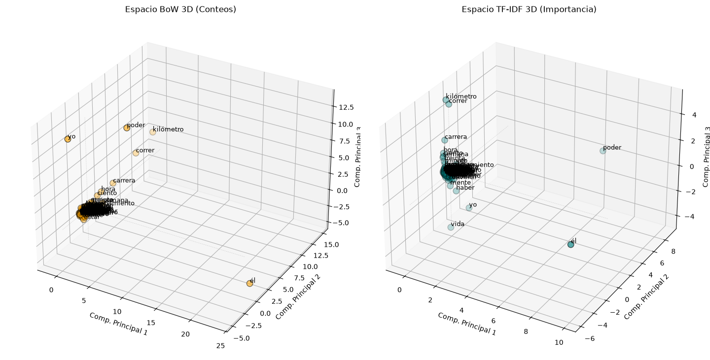
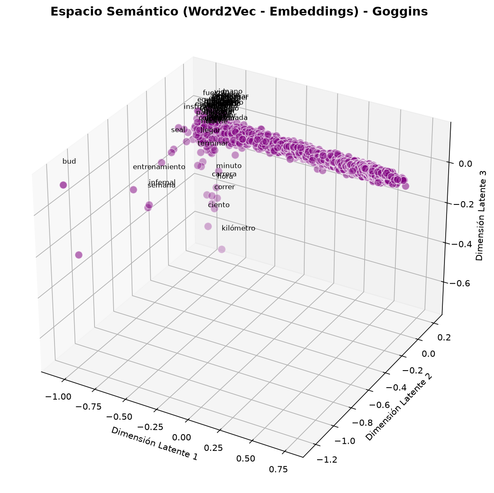

# Procesamiento de Lenguaje Natural — PLN

> ¿Puede una computadora entender de qué habla un libro sin que nadie se lo explique?
> Este proyecto lo intenta.

Se tomó *Can't Hurt Me* de David Goggins (en su versión en español) y se analizó con **PLN** (Procesamiento de Lenguaje Natural), el área de la inteligencia artificial que estudia cómo las computadoras pueden leer, interpretar y trabajar con texto humano.

---

## ¿Qué pasa aquí, en términos simples?

Imagina que le das el libro a alguien que no habla el idioma. No entiende nada, pero puede contar cuántas veces aparece cada palabra, cuáles aparecen juntas siempre, cuáles son raras. Con solo esas estadísticas, puede adivinar los temas del libro.

Eso es exactamente lo que hace este proyecto. Y funciona.

---

## Flujo del proyecto

```
libro.txt
    │
    ▼
Limpieza del texto          → quitar signos y stop words ("el", "la", "de"...)
    │
    ▼
Lematización                → "corriendo" y "corrió" se convierten en "correr"
    │
    ▼
Vectorización               → cada palabra se convierte en números comparables
    │         │
   BoW      TF-IDF          → dos formas distintas de pesar las palabras
    │
    ▼
Word2Vec                    → el modelo aprende el significado por contexto
    │
    ▼
Visualización 3D            → el espacio matemático proyectado para poder verlo
```

---

## Resultados

### Preprocesamiento

Antes de analizar el texto, se eliminan las *stop words*: palabras tan comunes ("el", "la", "y") que no aportan significado. Luego se aplica *lematización*: reducir cada palabra a su forma base para que "corriendo", "corrió" y "correrá" cuenten como la misma unidad.

Con el texto limpio, se generan dos tipos de representación vectorial, es decir, se convierte cada palabra en un vector de números para que la computadora pueda operar con ella matemáticamente.

---

### Bag of Words vs TF‑IDF



En el gráfico **BoW (izquierda)**, el modelo construye vectores contando cuántas veces aparece cada palabra en cada oración. El problema se ve al instante: **`yo`** y **`él`** flotan completamente aislados en los extremos del espacio, dominando el eje por puro volumen de apariciones. Por su frecuencia, la palabra *él* podría estar saturada de referencias al padre de Goggins o a sí mismo en tercera persona, pero el modelo de conteo no distingue el matiz. El resto del vocabulario se aplasta en una nube densa y confusa.

**TF‑IDF (derecha)** corrige eso. Premia las palabras que son frecuentes en una oración específica pero raras en el resto del corpus, y penaliza las genéricas. El resultado es radicalmente distinto:
- **`kilómetro`, `correr`, `carrera`, `hora`, `minuto` y `ciento`** se agrupan formando un clúster nítido en la parte superior izquierda, identificando el tema central de las *carreras*.
- **`él`** se desplaza al extremo inferior derecho, lejos del clúster central, lo que indica que aparece en pasajes narrativos muy específicos (probablemente biográficos), no en el discurso general.
- **`poder`** se aísla en el extremo derecho, emergiendo como un concepto con su propia firma semántica (el "poder mental" o "poder de voluntad").
- Incluso **`yo`** se reubica en el límite de la nube, ya sin distorsionar.

El algoritmo identificó estadísticamente los temas centrales del libro sin entender una sola palabra.

> **BoW te dice quién habla. TF‑IDF te dice de qué habla.**

---

### Word2Vec — cuando las palabras aprenden su propio significado

BoW y TF‑IDF trabajan con conteos. **Word2Vec** es una red neuronal que va más lejos: en lugar de contar palabras, **aprende el contexto** en el que aparecen. Cada palabra queda representada como un vector de 50 números (un *embedding*) posicionado en un espacio matemático donde las palabras con contextos similares quedan cerca entre sí. Sin que nadie le haya dicho qué significa ninguna.

El modelo se entrenó con la arquitectura **Skip‑gram**: dada una palabra, predice qué otras palabras suelen aparecer a su alrededor. Se eligió sobre su alternativa (CBOW) porque captura mejor las relaciones semánticas finas en corpus de tamaño moderado. Como el espacio tiene 50 dimensiones, se usó PCA (reducción de dimensionalidad) para proyectarlo a 3 y poder visualizarlo.



El gráfico 3D revela clústeres semánticos asombrosos:

- La densa nube central negra y morada agrupa todo el vocabulario genérico y de relleno del libro, donde las palabras aparecen en contextos demasiado variados para agruparse.
- En la zona central baja, **`kilómetro`** flota como un punto solitario. Aparece casi siempre en el mismo tipo de oración (medir distancias en carreras), lo que lo convierte en un concepto único y distintivo.
- A la izquierda, **`bud`** (abreviatura de **BUD/S**, *Basic Underwater Demolition/SEAL*, el entrenamiento de los SEAL) se encuentra absolutamente aislado en el extremo más lejano. Aparece en pasajes tan específicos y emocionalmente intensos que ninguna otra palabra se le acerca.
- Por debajo de la nube central, **`correr`, `carrera`, `hora`, `minuto` y `ciento`** forman una agrupación compacta, reflejando sin instrucciones el universo del *running*.
- En el sector medio-izquierdo, **`entrenamiento`, `infernal` y `semana`** crean su propio subclúster. El algoritmo detectó que estas palabras suelen aparecer juntas (las "semanas de entrenamiento infernal") y las posicionó en una misma zona del espacio semántico.
- **`seal`** (los equipos SEAL) también se separa del grupo general, situándose en el límite de la nube y confirmando su naturaleza única en el texto.

> **TF‑IDF te dice qué palabras importan. Word2Vec te dice qué palabras significan lo mismo.**

---

## Limitaciones

- Word2Vec se entrenó únicamente con este libro, así que sus embeddings reflejan las relaciones del texto de Goggins, no del idioma en general. Una palabra puede quedar cerca de otra simplemente porque ambas aparecen en situaciones similares dentro de esta obra.
- Que una palabra aparezca aislada en la gráfica tampoco significa automáticamente que sea un tema central del libro. Su posición depende de la frecuencia, el tamaño del corpus, los hiperparámetros del modelo y la propia reducción dimensional.
- Las visualizaciones son evidencia de patrones estadísticos, no una interpretación definitiva del texto.
- El análisis se realizó sobre la traducción al español del libro, por lo que ciertos matices del inglés original pueden perderse o alterarse.

---

## Próximos pasos

El proyecto puede extenderse bastante. Algunas direcciones interesantes:

- Comparar Skip‑gram vs CBOW.
- Experimentar con distintos tamaños de embedding y ventana de contexto.
- Entrenar el modelo con varios libros del mismo autor o del mismo género.
- Aplicar clustering para detectar grupos de palabras automáticamente.
- Probar con modelos más modernos como FastText o transformers.

La pregunta natural que sigue es: **¿los patrones que aparecen en este libro se mantienen cuando el corpus crece?**

---

## Instalación

```bash
python3 -m venv venv
source venv/bin/activate
pip install -r requirements.txt
python -m spacy download es_core_news_sm
```

**Requisitos:** Python 3.13

---

## Uso

```bash
python main.py
```

---

## Estructura del proyecto

```
.
├── main.py               # Script principal
├── libro.txt             # Texto a procesar
├── assets/
│   ├── Captura3D.png              # Visualización BoW vs TF-IDF
│   └── embeddings_3d_goggins.png  # Visualización Word2Vec
└── requirements.txt
```

---

## Dependencias principales

| Librería | Uso |
|---|---|
| spaCy | Tokenización, lematización, stop words |
| NLTK | Stemming comparativo |
| scikit‑learn | Vectorización (BoW, TF‑IDF) y reducción de dimensionalidad (PCA) |
| gensim | Entrenamiento del modelo Word2Vec |
| matplotlib | Visualización 3D del espacio vectorial |
| pandas | Tabla comparativa stemming vs lematización |